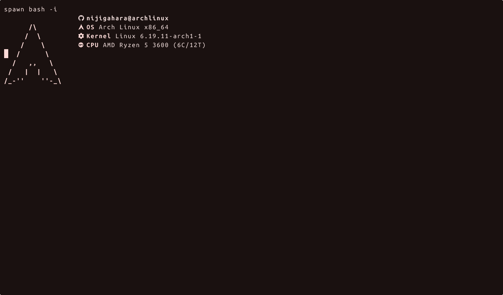

# Nijigahara Dotfiles

[](https://archlinux.org/)
[](https://www.chezmoi.io/)
[](https://gnupg.org/)
[](https://systemd.io/)

Personal Linux workstation dotfiles managed with `chezmoi`, protected with GPG-encrypted secrets, and synced back to GitHub automatically every day.

> This repo is first a real daily-driver setup, not a generic starter. It is organized to be restorable, readable, and maintainable without dragging in browser profiles, caches, or other machine junk.

## Preview

This setup leans into a coordinated desktop and terminal look instead of treating each tool as an island.

[](assets/demo/hero.gif)

The hero demo now records the actual daily-driver toolchain instead of a staged repo tour: `fastfetch`, the real `starship` prompt, `lazygit`, `zellij`, `tmux`, and `nvim`, all rendered with the `dankcolors` palette.

- [Watch the hero GIF](assets/demo/hero.gif)
- [Download the asciinema cast](assets/asciinema/hero.cast)
- [See how the media is generated](docs/media.md)

### Terminal Demos

| Demo | Focus |
| --- | --- |
| [`hero.gif`](assets/demo/hero.gif) | GitHub-friendly cast of the real shell, `lazygit`, `zellij`, `tmux`, and `nvim` flow |
| [`hero.cast`](assets/asciinema/hero.cast) | raw `asciinema` recording for higher-fidelity playback or re-rendering |

## Highlights

- `chezmoi`-managed home directory state
- GPG-encrypted secret files for tokens, credentials, and app secrets
- Daily `systemd --user` sync job that re-adds changes and pushes to remote
- Shared theme propagation through custom `matugen` scripts
- Terminal, editor, desktop, and media tooling kept in one source of truth
- Curated tracking scope with an explicit `.chezmoiignore`

## Stack

| Area | Tools |
| --- | --- |
| Shell | Bash, Starship |
| Terminal | Ghostty, tmux, Zellij |
| Editors | Neovim, Zed, Doom Emacs, VS Code, Cursor |
| Desktop | Hyprland, Niri, GTK theming, Xresources |
| Theme pipeline | Ghostty theme, Matugen scripts, Zellij/Zed/Blender sync |
| Dev workflow | gh, lazygit, chezmoi, GPG |
| Media and apps | OBS Studio, qBittorrent, Blender |

## What This Repo Manages

This repo tracks the parts of the machine that are worth rebuilding:

- shell startup files
- terminal and prompt configuration
- editor configuration
- window manager and desktop theming
- selected application settings
- encrypted secret-bearing config files
- automation for keeping the repo current

## What It Intentionally Does Not Manage

This repo does not try to preserve everything under `~`.

- browser profiles
- caches and package caches
- shell history
- editor workspace state and logs
- generated app data
- temporary and backup files
- machine-local runtime databases

That boundary is enforced by `.chezmoiignore` so the repo stays useful instead of noisy.

## Repository Layout

| Path | Purpose |
| --- | --- |
| `dot_*` | Files managed into `$HOME` by `chezmoi` |
| `dot_config/` | Main application and desktop config |
| `dot_local/bin/` | Local scripts, including automation helpers |
| `.chezmoi.toml.tmpl` | Template used to recreate chezmoi's own config |
| `.chezmoiignore` | Exclusion rules for junk, caches, and app state |
| `docs/` | Human-facing documentation for setup and maintenance |

## Quick Start

### 1. Import the GPG key used for encrypted files

```bash
gpg --import ~/Documents/chezmoi-gpg-backup/chezmoi-gpg-public.asc
gpg --import ~/Documents/chezmoi-gpg-backup/chezmoi-gpg-secret.asc
```

### 2. Initialize the repo with chezmoi

```bash
chezmoi init https://github.com/Nijigahara/dotfiles.git
```

### 3. Apply the managed files

```bash
chezmoi apply
```

### 4. Verify encrypted files can be read

```bash
chezmoi status
```

## Documentation

| Doc | Focus |
| --- | --- |
| [`docs/setup.md`](docs/setup.md) | Bootstrap and restore workflow |
| [`docs/secrets.md`](docs/secrets.md) | Encrypted files, GPG, and recovery |
| [`docs/automation.md`](docs/automation.md) | Daily sync service, timer, and debugging |
| [`dot_config/nvim/README.md`](dot_config/nvim/README.md) | Neovim-specific notes |

## Automation

This repo includes a daily auto-sync flow powered by a user `systemd` timer.

The job:

1. runs `chezmoi re-add --re-encrypt`
2. commits only when managed files changed
3. rebases against the remote branch
4. pushes the updated source repo back to GitHub

Relevant files:

- `dot_local/bin/executable_chezmoi-auto-sync`
- `dot_config/systemd/user/chezmoi-auto-sync.service`
- `dot_config/systemd/user/chezmoi-auto-sync.timer`

## Secrets

Secret-bearing files are stored as encrypted entries in the source repo instead of plain text. The repo template at `.chezmoi.toml.tmpl` restores the GPG recipient configuration, but decryption still requires the matching private key.

Read [`docs/secrets.md`](docs/secrets.md) before moving this setup to another machine.

## Theme Flow

One of the stronger opinions in this setup is that theme state should propagate instead of being configured by hand in every app.

The general flow is:

1. Ghostty theme acts as a source for generated colors
2. `matugen` helper scripts read those colors
3. downstream themes and config fragments are updated for tools like Zellij, Zed, Blender, and Discord-related styling

This keeps the system visually coherent without manually editing every consumer.

## Philosophy

These dotfiles are meant to be:

- practical enough for daily use
- explicit enough to restore confidently
- selective enough to avoid junk backup
- personal enough to reflect a real workstation instead of a template demo

## Credits

- [`chezmoi`](https://www.chezmoi.io/) for source-state management
- [`NvChad`](https://github.com/NvChad/NvChad) for the Neovim base used in this setup
- [`LazyVim starter`](https://github.com/LazyVim/starter) for inspiration referenced in the Neovim config lineage
- the maintainers of `Ghostty`, `Zellij`, `Zed`, `Hyprland`, `Niri`, `Matugen`, and related tools that make this setup possible

## Notes

- The repo is intentionally Linux-focused.
- Encrypted files require the matching GPG private key.
- Some application configs are backed up selectively rather than wholesale by design.
